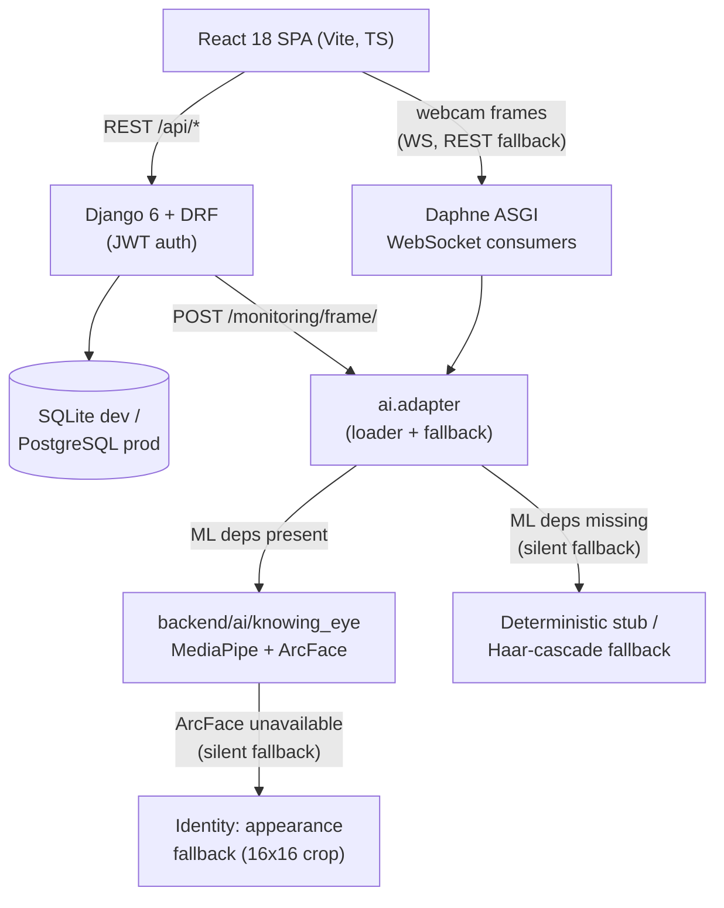

# Knowing Eye — System Brief (for the reviewer who didn't build it)

*Written for Kervy Cadiente (System Architect) to review as QA / capstone
reviewer. Everything here is verified against the code as of commit `e3a64bf`
on branch `kervy`, not copied from another doc. Where a doc and the code
disagree, this brief follows the code and says so.*

## 1. What the system does

**Knowing Eye** is a web-based examination platform for Legacy College of
Compostela's Guidance Office: examinees take timed, scored exams in a browser
while a webcam feed is analyzed for face presence, identity, gaze, and posture
to flag possible cheating in near-real time.

Six roles exist (`backend/features/authentication/models.py:22-28`), **not
two** — five documents in `docs/` still say `ADMIN`/`EXAMINEE`, but the code
and the tests have used this model since Sprint 1:

| Role | Intent |
|---|---|
| `ADMIN` | Full oversight; implicitly holds every permission |
| `GUIDANCE_STAFF` | Guidance-office operational role |
| `PROGRAM_HEAD` | Reviews and approves exams teachers submit |
| `FACULTY` | Creates/submits exams ("Teacher / Exam Creator") |
| `PROCTOR` | Live monitoring |
| `STUDENT` | Examinee — the only role self-registration can create |

## 2. Architecture



**The two silent fallbacks are the single most important thing to understand
before writing a test case against this system:**

1. `backend/ai/adapter.py` tries to import the real `BehaviorPipeline`; on
   *any* exception it swaps in a deterministic stub and sets
   `_PIPELINE_MODE = "stub"` — with no error surfaced to the operator. Check
   `GET /api/monitoring/health/` before trusting any monitoring test result.
2. Even in `production` mode, identity verification has its own fallback
   chain: ArcFace → `face_recognition` (dlib) → **appearance** (a normalized
   16×16 grayscale crop compared by cosine distance). In this repo's own
   dependency setup, `requirements-identity.txt` (ArcFace) is installed by
   neither `requirements.txt` nor `setup-venv.cmd`, so **appearance is what
   actually runs** unless someone installs it manually
   (`backend/ai/knowing_eye/recognition/identity.py:25-30,165-177`).

A green monitoring test under the default install proves the **API contract**,
not that a face was recognized. See `06-qa-findings.md` A-4/A-5.

## 3. The authorization model (read this before testing RBAC)

Three tiers, `backend/core/security/`:

1. **Role** — `HasRole(*roles)`. Admin always passes.
2. **Module access** — 12 modules (`dashboard`, `exams`, `exam-approvals`,
   `monitoring`, `behavior`, `reports`, `sessions`, `user-mgmt`, `settings`,
   `my-exams`, `my-results`, `my-profile`). Explicit deny beats explicit grant
   beats role default.
3. **Action permission** — 18 fine-grained permissions
   (`core/security/permissions_registry.py`) plus per-user grant/revoke with an
   audit trail (`PermissionChange` model).

**The important design fact:** only **3 places in the whole backend** use a DRF
`permission_classes` declaration for this (`exams/views.py:52,86`,
`authentication/views.py:267`). Everywhere else — sessions, behavior, most of
exams, all of reports — authorization is **imperative**: a `security.can(...)`
or `security.has_module(...)` call written inside the view method, or a
`ModelViewSet` whose `permission_classes = [IsAuthenticated]` relies entirely
on `get_queryset()` scoping to keep users away from data they shouldn't see.

This is exactly the design shape that produced the three critical findings in
`06-qa-findings.md` (A-1, A-2, A-3): a `ModelViewSet` scopes *which rows* a
user can see, but says nothing about *which HTTP verbs* they can use on the
rows they do see. Any test plan for this system has to test **verb × role**,
not just **route × role**.

## 4. Module map

| Module (app) | Models | Key endpoints | Frontend | Backing tests |
|---|---|---|---|---|
| `authentication` | `User`, `PermissionChange`, `EmailVerification` | `/api/auth/token/`, `/register/`, `/profile/*`, `/users/*` | Login, Register, Profile, Users admin | `test_auth_api.py` (12), `test_otp_verification.py` (11) |
| `exams` | `Department`, `ExamCategory`, `Exam`, `ExamSection`, `QuestionPool`, `ExamAssignment`, `Question`, `QuestionAttachment`, `ExamApprovalEvent` | `/api/exams/*`, `/departments/`, `/categories/` | Exam builder, dashboard list, grader | `test_exams_api.py` (10), `test_exams_rbac.py` (9), `test_sprint3_exam_lifecycle.py` (26), `test_exam_approval_chain.py` (14), `test_departments_api.py` (5), `test_seat_label.py` (2) |
| `session` (label `exam_sessions`) | `ExamSession` (UUID PK), `Response`, `SessionLog` | `/api/sessions/*`, `/responses/*` | Exam setup wizard, exam-taking page, submitted/results | `test_session_api.py` (15) |
| `monitoring` | `SessionIdentityReference` | `/api/monitoring/frame/`, `/enroll/`, `/health/`, `ws://ws/monitoring/*` | Live monitoring dashboard, camera step, proctoring dock | `test_monitoring_api.py` (10), `test_websocket.py` (6) |
| `behavior` | `BehaviorLog`, `Alert` | `/api/behavior/logs/`, `/alerts/*` | **No frontend surface** — see finding E-2 | `test_escalation.py` (13), `test_behavior_api.py` (2) |
| `reports` | *(none — read models from other apps)* | `/api/reports/summary/`, `/sessions/*`, `/export/{csv,pdf}/`, `/timeseries/` | Reports page (Tremor charts), exam summary | `test_reports_api.py` (7) |
| `core` (RBAC/PBAC engine) | none (uses Django `auth.Permission`) | `/api/auth/access-map/` | drives every route guard | `core/security/tests/test_service.py` (16) |

Plus `ai/tests/test_pipeline.py` (4 tests — **never actually run**, see
`06-qa-findings.md` C-2), `shared/tests/test_validators.py` (3),
`core/tests/test_smoke_api.py` (1 long end-to-end walk), `core/tests/test_exception_handler.py` (1).

**Total: 167 `def test_*` across 19 backend files** (verified by direct count —
not the "140+"/"142" figures in README/REPOSITORY_GUIDE/consistency report; see
finding B-4). Frontend: **33 tests across 6 files** (1.8% of 21,771 lines).

## 5. Data model — what exists today, not what `docs/database/` says

`docs/database/database_schema.json` is byte-identical to the copy in
`docs-old/` and describes 8 tables with `role: enum[admin, examinee]`. It
predates: categories, departments, the approval chain, question attachments,
email verification, per-user permission grants, seat labels, and exam
assignments. **Do not use it as a reference — read the model files directly**
(`backend/features/*/models.py`) or the ERD at
`docs/documentation/chapter2/assets/graphs/database-erd.dbml`, which is closer
but still worth spot-checking against code.

Entity relationships that matter for testing:

- `ExamSession` (UUID PK) is the hub: `Response`, `SessionLog`, `BehaviorLog`,
  `Alert`, and `SessionIdentityReference` all `FK/OneToOne(session,
  on_delete=CASCADE)`. Deleting a session deletes all proctoring evidence for
  it — this is what makes finding A-1 severe.
- `Question.correct_answer` is stored **in plaintext** on the model
  (`features/exams/models.py:383`).
- `Exam.created_by` is `on_delete=PROTECT` — an exam can't lose its creator
  without deliberately reassigning it first.

## 6. Running the system on Linux/macOS

Every existing runner (`start-dev.cmd`, `start-setup.cmd`, `test-all.cmd`,
`run-api.cmd`) is a Windows `.cmd` batch file hard-wired to
`backend\venv\Scripts\python.exe`. None of them work here. What actually works,
verified in this pass:

```bash
# Backend — the committed venv is Windows-only and incomplete; make your own.
# Requires Python >= 3.12 (Django 6.0.3 has no wheel for 3.11 or earlier —
# confirmed by trying: pip fails with "Requires-Python >=3.12").
cd backend
python3.12 -m venv venv
source venv/bin/activate
pip install -r requirements-core.txt   # Django, DRF, JWT, Channels/Daphne, decouple, reportlab
pip install -r requirements-cv.txt     # + numpy, opencv-python-headless, mediapipe
# requirements-identity.txt (ArcFace) is optional and NOT installed by
# anything above — see §2's identity fallback chain.

export DB_ENGINE=django.db.backends.sqlite3
export OPENBLAS_NUM_THREADS=1
python manage.py migrate
python manage.py seed_db --noinput
python -m daphne -b 127.0.0.1 -p 8000 core.config.asgi:application

# Frontend
cd ../frontend
npm install
npm run dev   # http://127.0.0.1:5173, proxies /api and /ws to :8000
```

**Seed accounts** (after `seed_db`): `admin`/`adminpass` (or your
`SEED_ADMIN_*` env vars), `examinee01`–`examinee20`/`pass001`–`pass020`. Also
present in `backend/seed_data/users.csv`: `examiner1`–`examiner4`, each seeded
with role **`ADMIN`** and a password equal to the username — see finding D-3
before using these for anything beyond local testing.

## 7. Where to go next

- Run the QA pass against `02-test-plan.md` and `03-test-cases.csv`.
- Read `06-qa-findings.md` before touching anything — three of the findings
  (A-1, A-2, A-3) are exploitable through the public API right now.
- Use `07-manual-checklists.md` for the RBAC/verb matrix, which is the pass
  that would have caught A-1–A-3 before this review.
